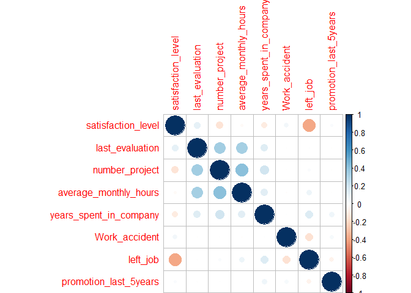
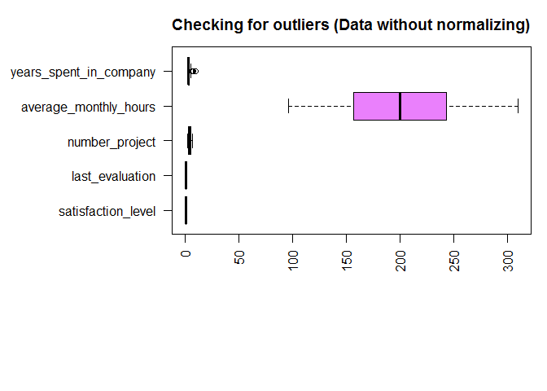
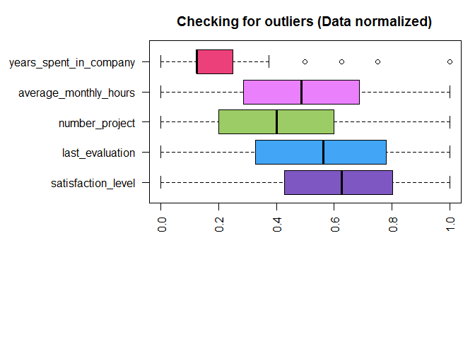
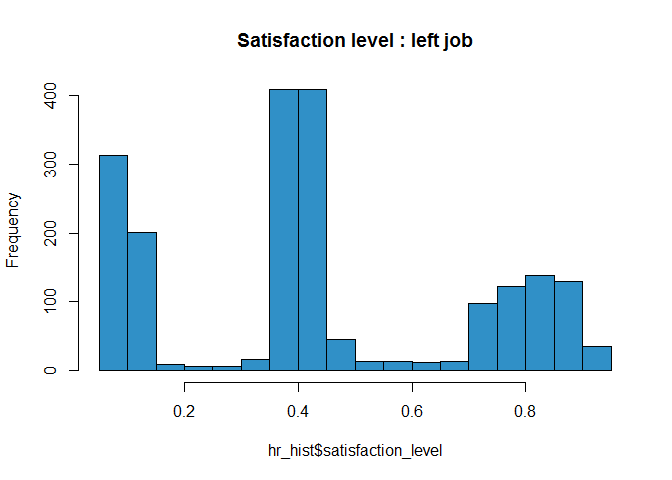

# Human Resources Analytics
Ng Jia Waie  
December 30, 2016  


##Data Collection
This dataset is related to the record of the employees in the company. This dataset contains 14999 rows and 10 columns. The dataset describes the satisfaction level of the company, last evaluation of their performance, number of projects they done, their average monthly working hours, the number of years spent in the company, whether the employee had a workplace accident, whether the employee left the workspace, their last promotion, the sales and the salary level.
<hr>

##Characteristic & Sumarry of Dataset 
In this figure below, it shows the correlation of each variables with few example of record. For example, each employee work on 3 to 4 projects in a year with around 200 hours per month.

```r
str(data)
```

```
## 'data.frame':	14999 obs. of  10 variables:
##  $ satisfaction_level    : num  0.38 0.8 0.11 0.72 0.37 0.41 0.1 0.92 0.89 0.42 ...
##  $ last_evaluation       : num  0.53 0.86 0.88 0.87 0.52 0.5 0.77 0.85 1 0.53 ...
##  $ number_project        : int  2 5 7 5 2 2 6 5 5 2 ...
##  $ average_monthly_hours : int  157 262 272 223 159 153 247 259 224 142 ...
##  $ years_spent_in_company: int  3 6 4 5 3 3 4 5 5 3 ...
##  $ Work_accident         : int  0 0 0 0 0 0 0 0 0 0 ...
##  $ left_job              : int  1 1 1 1 1 1 1 1 1 1 ...
##  $ promotion_last_5years : int  0 0 0 0 0 0 0 0 0 0 ...
##  $ department            : Factor w/ 10 levels "accounting","hr",..: 8 8 8 8 8 8 8 8 8 8 ...
##  $ salary                : Factor w/ 3 levels "high","low","medium": 2 3 3 2 2 2 2 2 2 2 ...
```

```r
summary(data)
```

```
##  satisfaction_level last_evaluation  number_project  average_monthly_hours
##  Min.   :0.0900     Min.   :0.3600   Min.   :2.000   Min.   : 96.0        
##  1st Qu.:0.4400     1st Qu.:0.5600   1st Qu.:3.000   1st Qu.:156.0        
##  Median :0.6400     Median :0.7200   Median :4.000   Median :200.0        
##  Mean   :0.6128     Mean   :0.7161   Mean   :3.803   Mean   :201.1        
##  3rd Qu.:0.8200     3rd Qu.:0.8700   3rd Qu.:5.000   3rd Qu.:245.0        
##  Max.   :1.0000     Max.   :1.0000   Max.   :7.000   Max.   :310.0        
##                                                                           
##  years_spent_in_company Work_accident       left_job     
##  Min.   : 2.000         Min.   :0.0000   Min.   :0.0000  
##  1st Qu.: 3.000         1st Qu.:0.0000   1st Qu.:0.0000  
##  Median : 3.000         Median :0.0000   Median :0.0000  
##  Mean   : 3.498         Mean   :0.1446   Mean   :0.2381  
##  3rd Qu.: 4.000         3rd Qu.:0.0000   3rd Qu.:0.0000  
##  Max.   :10.000         Max.   :1.0000   Max.   :1.0000  
##                                                          
##  promotion_last_5years       department      salary    
##  Min.   :0.00000       sales      :4140   high  :1237  
##  1st Qu.:0.00000       technical  :2720   low   :7316  
##  Median :0.00000       support    :2229   medium:6446  
##  Mean   :0.02127       IT         :1227                
##  3rd Qu.:0.00000       product_mng: 902                
##  Max.   :1.00000       marketing  : 858                
##                        (Other)    :2923
```

```r
head(data)
```

```
##   satisfaction_level last_evaluation number_project average_monthly_hours
## 1               0.38            0.53              2                   157
## 2               0.80            0.86              5                   262
## 3               0.11            0.88              7                   272
## 4               0.72            0.87              5                   223
## 5               0.37            0.52              2                   159
## 6               0.41            0.50              2                   153
##   years_spent_in_company Work_accident left_job promotion_last_5years
## 1                      3             0        1                     0
## 2                      6             0        1                     0
## 3                      4             0        1                     0
## 4                      5             0        1                     0
## 5                      3             0        1                     0
## 6                      3             0        1                     0
##   department salary
## 1      sales    low
## 2      sales medium
## 3      sales medium
## 4      sales    low
## 5      sales    low
## 6      sales    low
```

```r
corrplot(cor(data[,1:8]), method="circle")
```

<!-- -->
<hr>


##Data Preprocessing {.tabset .tabset-fade .tabset-pills}
In this section, we will transform raw data into an understandable format where raw data often incomplete, inconsistent, and/or lacking in certain behaviors or trends, and is likely to contain many errors.


###Data Transformation {.tabset}
We had done some transformation on the dataset, below is the code that we had perform and result will be in check for outliner which under data cleaning.

```r
preprocessParams <- preProcess(data[,1:8], method=c("range"))
normData <- predict(preprocessParams, data[,1:8])
```
<hr>

###Data Cleaning {.tabset}
We had done some data cleaning works such as remove duplicate data, check for NA and check for outliner. 

####Correct Inconsistent Data
In the figure below contain some preprocessing work that we had done.

```r
colnames(data)[names(data) == "sales"] <- "department"
colnames(data)[names(data) == "time_spend_company"] <- "years_spent_in_company"
colnames(data)[names(data) == "left"] <- "left_job"
colnames(data)[names(data) == "average_montly_hours"] <- "average_monthly_hours"
```
<br>
Current dataset will be look like this:

```
##   satisfaction_level last_evaluation number_project average_monthly_hours
## 1               0.38            0.53              2                   157
## 2               0.80            0.86              5                   262
## 3               0.11            0.88              7                   272
## 4               0.72            0.87              5                   223
## 5               0.37            0.52              2                   159
## 6               0.41            0.50              2                   153
##   years_spent_in_company Work_accident left_job promotion_last_5years
## 1                      3             0        1                     0
## 2                      6             0        1                     0
## 3                      4             0        1                     0
## 4                      5             0        1                     0
## 5                      3             0        1                     0
## 6                      3             0        1                     0
##   department salary
## 1      sales    low
## 2      sales medium
## 3      sales medium
## 4      sales    low
## 5      sales    low
## 6      sales    low
```
<hr>

####Remove Duplicate
Previously, we have 14999 record.

```
## [1] 14999    10
```
Duplicate record :

```
## [1] 3008
```
After remove duplicate entries, we had left 11991 record.

```
## [1] 11991    10
```
<hr>

####Check For NA
We had also check for any not available value contain in each variable

```r
any(is.na(data))
```

```
## [1] FALSE
```
Since there isn't any NA contain in the dataset, hence no imputation required.
<br>
<hr>

####Check For Outlier
We had check for outlier in each column of data set for both before normalize and after normalize and result will be shown below:
<br>
<br>
Below is the graph of outlier before normalize:
<!-- -->

Below is the graph of outlier after normalize:
<!-- -->
Although that we based on the graph above show that years spent in company contain some outlier, but after examine the code below, we conclude that those outlier is valid for the variable.

```r
(outliers <- levels(factor(boxplot.stats(data[,'years_spent_in_company'])$out)))
(oriValues <- levels(factor(data[,'years_spent_in_company'])))
```
<br>
<br>
<hr>


###Data Reduction {.tabset}
After we remove duplicate record, we found out that our record isn't very big. We decided not to do data sampling due to if we sampling the data, and it might affect our data analysis part.
<br>
<strong>Sampling data in our case is optional.<strong>
<hr>


##Data Analysis
In the figure below, we had done some analysis steps to get meaningful information from the dataset.


###Satisfaction Level
   In this part, we want to found out relationship between Satisfaction Level and people who left job and we found out that those who left have low satisfaction level contain the most compare other satisfaction level.

<!-- -->


#Answer for Part 1 Assignment
A.	Describe the dataset
<br>
This dataset is related to the record of the employees in the company. This dataset contains 14999 rows and 10 columns. The dataset describes the satisfaction level of the company, last evaluation of their performance, number of projects they done, their average monthly working hours, the number of years spent in the company, whether the employee had a workplace accident, whether the employee left the workspace, their last promotion, the sales and the salary level. We had found out that some of the column names are too ambiguous, for example, the column "last_evaluation" does not give a clear meaning. Besides, the data unit of the column is ambiguous, for example, the column name "time_spend_company" is recorded in integers values (3,4,5), however, it could represent anything, and in this case, represents unit years. Another problem that we found in this dataset is that true and false are represented as 1 and 0 instead. 
<br>
<br>
B.	Insight
<br>
The insight that we wish to extract from this dataset is the next employee who will likely leave the company. We want to find out how to keep employees satisfied.  
<br>
<br>
C.	Data Mining Technique
<br>
The data mining technique that will be relevant is classification, by analysing the dataset we can find out what kind of employees are likely to leave the company.  For example, we can look in the satisfaction level, the number of projects and salary rate to determine whether the employee will leave or stay in the company. Another data mining technique that we wish to apply is association rule. For example, we can discover someone with the different level of salary across the different department that will have a high likelihood of leaving the company.
<br>
<br>
D.	Data quality issues
<br>
After checking the dataset against the six data qualities dimension which is uniqueness, timeliness, completeness, consistency, accuracy, and validity, we found out that the dataset contains duplicate entry and may need processing. Besides, some of the column names do not properly describe its content such that:
<br>
-	time_spend_company - the column name didn't specify the data unit
<br>
-	last_evalution - we do not know what the column name is trying to imply.
<br>
-	Sales - the column name is not relevant to the values.
<br>
-	average_montly_hours - Spelling Error


